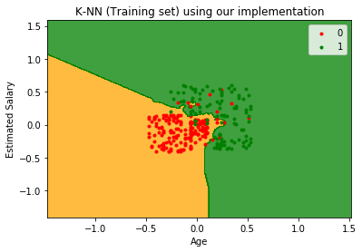
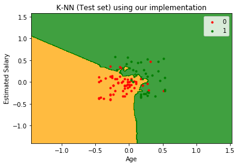
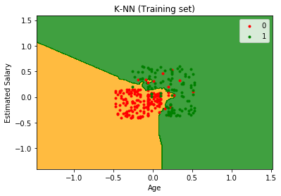
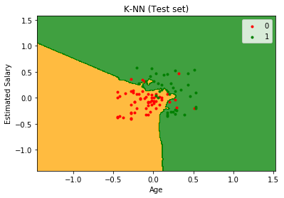

# KNN or K-Nearest Neighbours

KNN is a lazy learning algorithm which is used for classification. In this algorithm, the unknown or test set data will consider 'K' nearest neighbours from training set and predict the class based on count of its 'K' nearest neighbours i.e Among it's K nearest neighbours, which ever class has the highest count, it will be assigned to that particular class. Steps involved in this algorithm are:

1. Choose the number K of neighbours
2. Take the K nearest neighbours of the new data point, according to Euclidian Distance
3. Among the data points, count the number of datapoints in each category.
4. Assign the new data point to the category where you counted the most neighbours.


```python
# -*- coding: utf-8 -*-
"""
Created on Mon Nov 26 16:06:25 2018

@author: purandur
"""
#imporing libraries
import numpy as np
import matplotlib.pyplot as plt
import pandas as pd
import time
```


```python
#feature scaling
class FeatureScaling:
    def __init__(self,X,y):
        self.X=X.copy()
        if y.ndim==1:
            y=np.reshape(y,(y.shape[0],1))
        self.y=y.copy()
        self.minMax_X={}
        self.minMax_y={}
    
    def fit_transform_X(self):
        num_of_features=self.X.shape[1]
        for i in range(num_of_features):
            feature=self.X[:,i]
            Mean=np.mean(feature)
            Min=np.min(feature)
            Max=np.max(feature)
            feature=(feature-Mean)/(Max-Min)
            self.minMax_X[i]=np.array([Mean,Min,Max])
            self.X[:,i]=feature
        return self.X.copy()
    
    def fit_transform_Y(self):
        num_of_features=self.y.shape[1]
        for i in range(num_of_features):
            feature=self.y[:,i]
            Mean=np.mean(feature)
            Min=np.min(feature)
            Max=np.max(feature)
            feature=(feature-Mean)/(Max-Min)
            self.minMax_y[i]=np.array([Mean,Min,Max])
            self.y[:,i]=feature
        return np.reshape(self.y,self.y.shape[0])
    
    def inverse_transform_X(self,X):
        X_transformed=X.copy()
        num_of_features=X_transformed.shape[1]
        for i in range(num_of_features):
            feature=X_transformed[:,i]
            Mean=self.minMax_X[i][0]
            Min=self.minMax_X[i][1]
            Max=self.minMax_X[i][2]
            feature=feature*(Max-Min)+Mean
            X_transformed[:,i]=feature
        return X_transformed
    
    def inverse_transform_Y(self,y):
        y_transformed=y.copy()
        if y_transformed.ndim==1:
            y_transformed=np.reshape(y_transformed,(y_transformed.shape[0],1))
        num_of_features=y_transformed.shape[1]
        for i in range(num_of_features):
            feature=y_transformed[:,i]
            Mean=self.minMax_y[i][0]
            Min=self.minMax_y[i][1]
            Max=self.minMax_y[i][2]
            feature=feature*(Max-Min)+Mean
            y_transformed[:,i]=feature
        return np.reshape(y_transformed,y_transformed.shape[0])
    
    def transform_X(self,X):
        X_transformed=X.copy()
        num_of_features=X_transformed.shape[1]
        for i in range(num_of_features):
            feature=X_transformed[:,i]
            Mean=self.minMax_X[i][0]
            Min=self.minMax_y[i][1]
            Max=self.minMax_y[i][2]
            feature=(feature-Mean)/(Max-Min)
            X_transformed[:,i]=feature
        return X_transformed
    
    def transform_Y(self,y):
        y_transformed=y.copy()
        if y_transformed.ndim==1:
            y_transformed=np.reshape(y_transformed,(y_transformed.shape[0],1))
        num_of_features=y_transformed.shape[1]
        for i in range(num_of_features):
            feature=y_transformed[:,i]
            Mean=self.minMax_y[i][0]
            Min=self.minMax_y[i][1]
            Max=self.minMax_y[i][2]
            feature=(feature-Mean)/(Max-Min)
            y_transformed[:,i]=feature
        return np.reshape(y_transformed,y_transformed.shape[0])
    
    def returnX(self):
        return self.X
    
    def returnY(self):
        return self.y
```


```python
import numpy as np
class KNN:
    def __init__(self,X_train,Y_train,K):
        self.X_train=X_train
        self.Y_train=Y_train
        self.K=K
        
    def predict(self,X):
        y_pred=np.array([])
        for each in X:
            ed=np.sum((each-self.X_train)**2,axis=1)
            y_ed=np.concatenate((self.Y_train.reshape(self.Y_train.shape[0],1),ed.reshape(ed.shape[0],1)),axis=1)
            y_ed=y_ed[y_ed[:,1].argsort()]
            K_neighbours=y_ed[0:self.K]
            (values,counts) = np.unique(K_neighbours[:,0].astype(int),return_counts=True)
            y_pred=np.append(y_pred,values[np.argmax(counts)])
        return y_pred
            
```


```python
#reading dataset
Data=pd.read_csv('Social_Network_Ads.csv')
print(Data.head(10))
Data.describe()
```

        User ID  Gender  Age  EstimatedSalary  Purchased
    0  15624510    Male   19            19000          0
    1  15810944    Male   35            20000          0
    2  15668575  Female   26            43000          0
    3  15603246  Female   27            57000          0
    4  15804002    Male   19            76000          0
    5  15728773    Male   27            58000          0
    6  15598044  Female   27            84000          0
    7  15694829  Female   32           150000          1
    8  15600575    Male   25            33000          0
    9  15727311  Female   35            65000          0
    


<div>
<style scoped>
    .dataframe tbody tr th:only-of-type {
        vertical-align: middle;
    }

    .dataframe tbody tr th {
        vertical-align: top;
    }

    .dataframe thead th {
        text-align: right;
    }
</style>
<table border="1" class="dataframe">
  <thead>
    <tr style="text-align: right;">
      <th></th>
      <th>User ID</th>
      <th>Age</th>
      <th>EstimatedSalary</th>
      <th>Purchased</th>
    </tr>
  </thead>
  <tbody>
    <tr>
      <th>count</th>
      <td>4.000000e+02</td>
      <td>400.000000</td>
      <td>400.000000</td>
      <td>400.000000</td>
    </tr>
    <tr>
      <th>mean</th>
      <td>1.569154e+07</td>
      <td>37.655000</td>
      <td>69742.500000</td>
      <td>0.357500</td>
    </tr>
    <tr>
      <th>std</th>
      <td>7.165832e+04</td>
      <td>10.482877</td>
      <td>34096.960282</td>
      <td>0.479864</td>
    </tr>
    <tr>
      <th>min</th>
      <td>1.556669e+07</td>
      <td>18.000000</td>
      <td>15000.000000</td>
      <td>0.000000</td>
    </tr>
    <tr>
      <th>25%</th>
      <td>1.562676e+07</td>
      <td>29.750000</td>
      <td>43000.000000</td>
      <td>0.000000</td>
    </tr>
    <tr>
      <th>50%</th>
      <td>1.569434e+07</td>
      <td>37.000000</td>
      <td>70000.000000</td>
      <td>0.000000</td>
    </tr>
    <tr>
      <th>75%</th>
      <td>1.575036e+07</td>
      <td>46.000000</td>
      <td>88000.000000</td>
      <td>1.000000</td>
    </tr>
    <tr>
      <th>max</th>
      <td>1.581524e+07</td>
      <td>60.000000</td>
      <td>150000.000000</td>
      <td>1.000000</td>
    </tr>
  </tbody>
</table>
</div>


```python
#training and testing set size
train_size=int(0.75*Data.shape[0])
test_size=int(0.25*Data.shape[0])
print("Training set size : "+ str(train_size))
print("Testing set size : "+str(test_size))
```

    Training set size : 300
    Testing set size : 100
    


```python
#Getting features from dataset
Data=Data.sample(frac=1)
X=Data.iloc[:,[2, 3]].values
y=Data.iloc[:,4].values
X=X.astype(float)
```


```python
#feature scaling
fs=FeatureScaling(X,y)
X=fs.fit_transform_X()
```


```python
#training set split
X_train=X[0:train_size,:]
Y_train=y[0:train_size]
```


```python
#testing set split
X_test=X[train_size:,:]
Y_test=y[train_size:]
```


```python
l=time.time()
knn=KNN(X_train,Y_train,5)
y_pred=knn.predict(X_test)
r=time.time()
KNN_learn_time=(r-l)
print(r-l)
```

    0.017045021057128906
    


```python
#getting the confusion matrix
tp=len([i for i in range(0,Y_test.shape[0]) if Y_test[i]==0 and y_pred[i]==0])
tn=len([i for i in range(0,Y_test.shape[0]) if Y_test[i]==0 and y_pred[i]==1])
fp=len([i for i in range(0,Y_test.shape[0]) if Y_test[i]==1 and y_pred[i]==0])
fn=len([i for i in range(0,Y_test.shape[0]) if Y_test[i]==1 and y_pred[i]==1])
confusion_matrix=np.array([[tp,tn],[fp,fn]])
print(confusion_matrix)
```

    [[54  8]
     [ 6 32]]
    


```python
#Same algorithm using sklearn KNN just for comparsion purpose
from sklearn.neighbors import KNeighborsClassifier
classifier = KNeighborsClassifier(n_neighbors = 5, metric = 'minkowski', p = 2)
l=time.time()
classifier.fit(X_train, Y_train)
y_pred_sklearn = classifier.predict(X_test)
r=time.time()
sklearn_time=(r-l)
print(sklearn_time)
```

    0.0020058155059814453
    


```python
print("But sklearn time is faster than our implementation by: "+str(KNN_learn_time/sklearn_time)+" times")
```

    But sklearn time is faster than our implementation by: 8.497801022227504 times
    


```python
# Making the Confusion Matrix
from sklearn.metrics import confusion_matrix
cm = confusion_matrix(Y_test, y_pred_sklearn)
print(cm)
```

    [[54  8]
     [ 6 32]]
    


```python
# Visualising the Training set results for our implementation
l=time.time()
from matplotlib.colors import ListedColormap
X_set, y_set = X_train, Y_train
X1, X2 = np.meshgrid(np.arange(start = X_set[:, 0].min() - 1, stop = X_set[:, 0].max() + 1, step = 0.01),
                     np.arange(start = X_set[:, 1].min() - 1, stop = X_set[:, 1].max() + 1, step = 0.01))
plt.contourf(X1, X2, knn.predict(np.array([X1.ravel(), X2.ravel()]).T).reshape(X1.shape),
             alpha = 0.75, cmap = ListedColormap(('orange', 'green')))
plt.xlim(X1.min(), X1.max())
plt.ylim(X2.min(), X2.max())
for i, j in enumerate(np.unique(y_set)):
    plt.scatter(X_set[y_set == j, 0], X_set[y_set == j, 1],
                c = ListedColormap(('red', 'green'))(i), label = j,marker='.')
plt.title('K-NN (Training set) using our implementation')
plt.xlabel('Age')
plt.ylabel('Estimated Salary')
plt.legend()
plt.show()
r=time.time()
print("Time required for plotting is: "+str(r-l)+" seconds")
```





    Time required for plotting is: 25.802637815475464 seconds
    


```python
# Visualising the Test set results for our implementation
l=time.time()
X_set, y_set = X_test, Y_test
X1, X2 = np.meshgrid(np.arange(start = X_set[:, 0].min() - 1, stop = X_set[:, 0].max() + 1, step = 0.01),
                     np.arange(start = X_set[:, 1].min() - 1, stop = X_set[:, 1].max() + 1, step = 0.01))
plt.contourf(X1, X2, knn.predict(np.array([X1.ravel(), X2.ravel()]).T).reshape(X1.shape),
             alpha = 0.75, cmap = ListedColormap(('orange', 'green')))
plt.xlim(X1.min(), X1.max())
plt.ylim(X2.min(), X2.max())
for i, j in enumerate(np.unique(y_set)):
    plt.scatter(X_set[y_set == j, 0], X_set[y_set == j, 1],
                c = ListedColormap(('red', 'green'))(i), label = j,marker='.')
plt.title('K-NN (Test set) using our implementation')
plt.xlabel('Age')
plt.ylabel('Estimated Salary')
plt.legend()
plt.show()
r=time.time()
print("Time required for plotting is: "+str(r-l)+" seconds")
```





    Time required for plotting is: 22.427660942077637 seconds
    


```python
# Visualising the Training set results for sklearn class
l=time.time()
X_set, y_set = X_train, Y_train
X1, X2 = np.meshgrid(np.arange(start = X_set[:, 0].min() - 1, stop = X_set[:, 0].max() + 1, step = 0.01),
                     np.arange(start = X_set[:, 1].min() - 1, stop = X_set[:, 1].max() + 1, step = 0.01))
plt.contourf(X1, X2, classifier.predict(np.array([X1.ravel(), X2.ravel()]).T).reshape(X1.shape),
             alpha = 0.75, cmap = ListedColormap(('orange', 'green')))
plt.xlim(X1.min(), X1.max())
plt.ylim(X2.min(), X2.max())
for i, j in enumerate(np.unique(y_set)):
    plt.scatter(X_set[y_set == j, 0], X_set[y_set == j, 1],
                c = ListedColormap(('red', 'green'))(i), label = j,marker='.')
plt.title('K-NN (Training set)')
plt.xlabel('Age')
plt.ylabel('Estimated Salary')
plt.legend()
plt.show()
r=time.time()
print("Time required for plotting is: "+str(r-l)+" seconds")
```





    Time required for plotting is: 0.48911190032958984 seconds
    


```python
# Visualising the Test set results for sklearn class
l=time.time()
X_set, y_set = X_test, Y_test
X1, X2 = np.meshgrid(np.arange(start = X_set[:, 0].min() - 1, stop = X_set[:, 0].max() + 1, step = 0.01),
                     np.arange(start = X_set[:, 1].min() - 1, stop = X_set[:, 1].max() + 1, step = 0.01))
plt.contourf(X1, X2, classifier.predict(np.array([X1.ravel(), X2.ravel()]).T).reshape(X1.shape),
             alpha = 0.75, cmap = ListedColormap(('orange', 'green')))
plt.xlim(X1.min(), X1.max())
plt.ylim(X2.min(), X2.max())
for i, j in enumerate(np.unique(y_set)):
    plt.scatter(X_set[y_set == j, 0], X_set[y_set == j, 1],
                c = ListedColormap(('red', 'green'))(i), label = j,marker='.')
plt.title('K-NN (Test set)')
plt.xlabel('Age')
plt.ylabel('Estimated Salary')
plt.legend()
plt.show()
r=time.time()
print("Time required for plotting is: "+str(r-l)+" seconds")
```





    Time required for plotting is: 0.47005295753479004 seconds
    

Conclusion is our implementation is slower but still we have achieved similar results compared to sklearn package


```python

```
