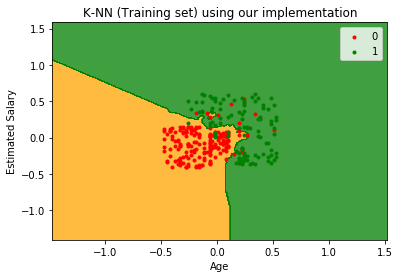
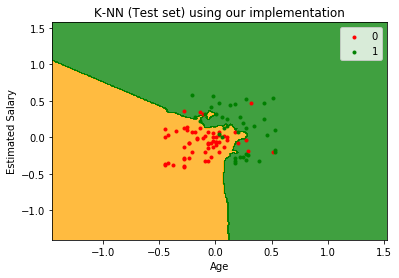
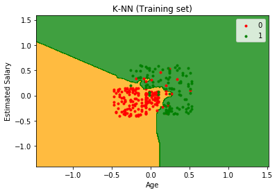
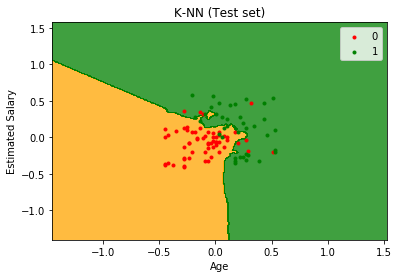

# KNN or K-Nearest Neighbours

## Apa Itu KNN (K-Nearest Neighbour) ??

Algoritma K-Nearest Neighbor (KNN) adalah sebuah metode klasifikasi terhadap sekumpulan data berdasarkan pembelajaran data yang sudah terklasifikasikan sebelumya. Termasuk dalam *supervised learning*, dimana hasil *query instance* yang baru diklasifikasikan berdasarkan mayoritas kedekatan jarak dari kategori yang ada dalam **K-NN.**

Tujuan dari algoritma ini adalah untuk mengklasifikasikan obyek baru berdasarkan atribut dan *sample-sample* dari *training data*.

#### Kelebihan dan Kekurangan KNN (K-Nearest Neighbor)

**Kelebihan KNN (K-Nearest Neighbour)**

1. Sangat nonlinear.
2. Mudah dipahami dan diimplementasikan.

**Kekurangan KNN (K-Nearest Neighbour)**

1. Perlu menunjukkan parameter K (jumlah tetangga terdekat).
2. Tidak menangani nilai hilang (*missing value*) secara implisit.
3. Sensitif terhadap data pencilan (*outlier*).
4. Rentan terhadap variabel yang non-informatif.
5. Rentan terhadap dimensionalitas yang tinggi.
6. Biaya komputasi cukup tinggi karena diperlukan perhitungan jarak dari setiap sampel uji pada keseluruhan sampel latih.


# Study Kasus

Data yang digunakan pada kali ini adalah data yang diperoleh dari [www.kaggle.com](http://www.kaggle.com/) yaitu Social_Network_Ads.csv.

### Step 1, Import package

dengan menggunakan python 3.7

library yang diperlukan :


```python
# -*- coding: utf-8 -*-
"""
Created on Mon May 6 20:06:25 2019

@author: agielasyari1
"""
#imporing libraries
import numpy as np
import matplotlib.pyplot as plt
import pandas as pd
import time
```
### Step 2, Feature scalling

Wikipedia-

> “Since the range of values of raw data varies widely, in some machine learning algorithms, objective functions will not work properly without normalization. For example, the majority of classifiers calculate the distance between two points by the Euclidean distance. If one of the features has a broad range of values, the distance will be governed by this particular feature. Therefore, the range of all features should be normalized so that each feature contributes approximately proportionately to the final distance.”

​	Jadi karena klasifikasi KNN dihitung berdasarkan jarak Euclidean antar dua titik. Jika salah satu variabel memiliki jarak yang dengan rentang yang jauh(nilai yg jauh lebih tinggi),maka nilai tersebut harus disesuaikan. Jadi jarak antara semua variabel harus dinormalisasikan agar jarak akhir yang didapatkan proposional.

```python
#feature scaling
class FeatureScaling:
    def __init__(self,X,y):
        self.X=X.copy()
        if y.ndim==1:
            y=np.reshape(y,(y.shape[0],1))
        self.y=y.copy()
        self.minMax_X={}
        self.minMax_y={}
    
    def fit_transform_X(self):
        num_of_features=self.X.shape[1]
        for i in range(num_of_features):
            feature=self.X[:,i]
            Mean=np.mean(feature)
            Min=np.min(feature)
            Max=np.max(feature)
            feature=(feature-Mean)/(Max-Min)
            self.minMax_X[i]=np.array([Mean,Min,Max])
            self.X[:,i]=feature
        return self.X.copy()
    
    def fit_transform_Y(self):
        num_of_features=self.y.shape[1]
        for i in range(num_of_features):
            feature=self.y[:,i]
            Mean=np.mean(feature)
            Min=np.min(feature)
            Max=np.max(feature)
            feature=(feature-Mean)/(Max-Min)
            self.minMax_y[i]=np.array([Mean,Min,Max])
            self.y[:,i]=feature
        return np.reshape(self.y,self.y.shape[0])
    
    def inverse_transform_X(self,X):
        X_transformed=X.copy()
        num_of_features=X_transformed.shape[1]
        for i in range(num_of_features):
            feature=X_transformed[:,i]
            Mean=self.minMax_X[i][0]
            Min=self.minMax_X[i][1]
            Max=self.minMax_X[i][2]
            feature=feature*(Max-Min)+Mean
            X_transformed[:,i]=feature
        return X_transformed
    
    def inverse_transform_Y(self,y):
        y_transformed=y.copy()
        if y_transformed.ndim==1:
            y_transformed=np.reshape(y_transformed,(y_transformed.shape[0],1))
        num_of_features=y_transformed.shape[1]
        for i in range(num_of_features):
            feature=y_transformed[:,i]
            Mean=self.minMax_y[i][0]
            Min=self.minMax_y[i][1]
            Max=self.minMax_y[i][2]
            feature=feature*(Max-Min)+Mean
            y_transformed[:,i]=feature
        return np.reshape(y_transformed,y_transformed.shape[0])
    
    def transform_X(self,X):
        X_transformed=X.copy()
        num_of_features=X_transformed.shape[1]
        for i in range(num_of_features):
            feature=X_transformed[:,i]
            Mean=self.minMax_X[i][0]
            Min=self.minMax_y[i][1]
            Max=self.minMax_y[i][2]
            feature=(feature-Mean)/(Max-Min)
            X_transformed[:,i]=feature
        return X_transformed
    
    def transform_Y(self,y):
        y_transformed=y.copy()
        if y_transformed.ndim==1:
            y_transformed=np.reshape(y_transformed,(y_transformed.shape[0],1))
        num_of_features=y_transformed.shape[1]
        for i in range(num_of_features):
            feature=y_transformed[:,i]
            Mean=self.minMax_y[i][0]
            Min=self.minMax_y[i][1]
            Max=self.minMax_y[i][2]
            feature=(feature-Mean)/(Max-Min)
            y_transformed[:,i]=feature
        return np.reshape(y_transformed,y_transformed.shape[0])
    
    def returnX(self):
        return self.X
    
    def returnY(self):
        return self.y
```

### Step 3 Train

​	Saya menerapkan kelas KNN dengan fungsi standar 'cocok' untuk pelatihan dan 'prediksi' untuk memprediksi data uji. KNN menggunakan *lazy algoritm* yang berarti semua perhitungan ditangguhkan hingga prediksi. Dalam metode fit, saya hanya menetapkan data pelatihan ke variabel kelas - xtrain dan ytrain. Tidak diperlukan perhitungan.

​	Saat saya mengulangi setiap baris pelatihan untuk mendapatkan skor kesamaan, saya menggunakan document_similarity fungsi kustom yang menerima dua teks dan mengembalikan skor kesamaan di antara mereka (0 & 1). Skor kesamaan yang lebih tinggi menunjukkan lebih banyak kesamaan di antara mereka.


```python
import numpy as np
class KNN:
    def __init__(self,X_train,Y_train,K):
        self.X_train=X_train
        self.Y_train=Y_train
        self.K=K
        
    def predict(self,X):
        y_pred=np.array([])
        for each in X:
            ed=np.sum((each-self.X_train)**2,axis=1)
            y_ed=np.concatenate((self.Y_train.reshape(self.Y_train.shape[0],1),ed.reshape(ed.shape[0],1)),axis=1)
            y_ed=y_ed[y_ed[:,1].argsort()]
            K_neighbours=y_ed[0:self.K]
            (values,counts) = np.unique(K_neighbours[:,0].astype(int),return_counts=True)
            y_pred=np.append(y_pred,values[np.argmax(counts)])
        return y_pred
            
```

### Step 4 , Read data


```python
#reading dataset
Data=pd.read_csv('Social_Network_Ads.csv')
print(Data.head(10))
Data.describe()
```

#### Output


        User ID  Gender  Age  EstimatedSalary  Purchased
    0  15624510    Male   19            19000          0
    1  15810944    Male   35            20000          0
    2  15668575  Female   26            43000          0
    3  15603246  Female   27            57000          0
    4  15804002    Male   19            76000          0
    5  15728773    Male   27            58000          0
    6  15598044  Female   27            84000          0
    7  15694829  Female   32           150000          1
    8  15600575    Male   25            33000          0
    9  15727311  Female   35            65000          0

<div>
<style scoped>
    .dataframe tbody tr th:only-of-type {
        vertical-align: middle;
    }


<table border="1" class="dataframe">
  <thead>
    <tr style="text-align: right;">
      <th></th>
      <th>User ID</th>
      <th>Age</th>
      <th>EstimatedSalary</th>
      <th>Purchased</th>
    </tr>
  </thead>
  <tbody>
    <tr>
      <th>count</th>
      <td>4.000000e+02</td>
      <td>400.000000</td>
      <td>400.000000</td>
      <td>400.000000</td>
    </tr>
    <tr>
      <th>mean</th>
      <td>1.569154e+07</td>
      <td>37.655000</td>
      <td>69742.500000</td>
      <td>0.357500</td>
    </tr>
    <tr>
      <th>std</th>
      <td>7.165832e+04</td>
      <td>10.482877</td>
      <td>34096.960282</td>
      <td>0.479864</td>
    </tr>
    <tr>
      <th>min</th>
      <td>1.556669e+07</td>
      <td>18.000000</td>
      <td>15000.000000</td>
      <td>0.000000</td>
    </tr>
    <tr>
      <th>25%</th>
      <td>1.562676e+07</td>
      <td>29.750000</td>
      <td>43000.000000</td>
      <td>0.000000</td>
    </tr>
    <tr>
      <th>50%</th>
      <td>1.569434e+07</td>
      <td>37.000000</td>
      <td>70000.000000</td>
      <td>0.000000</td>
    </tr>
    <tr>
      <th>75%</th>
      <td>1.575036e+07</td>
      <td>46.000000</td>
      <td>88000.000000</td>
      <td>1.000000</td>
    </tr>
    <tr>
      <th>max</th>
      <td>1.581524e+07</td>
      <td>60.000000</td>
      <td>150000.000000</td>
      <td>1.000000</td>
    </tr>
  </tbody>
</table>
### Step 5, Traning & Testing

saya menggambil sampel untuk ditraining dari keseluruhan data yaitu 75% dan untuk ditesting 25%


```python
#training and testing set size
train_size=int(0.75*Data.shape[0])
test_size=int(0.25*Data.shape[0])
print("Training set size : "+ str(train_size))
print("Testing set size : "+str(test_size))
```

    Training set size : 300
    Testing set size : 100

```python
#Getting features from dataset
Data=Data.sample(frac=1)
X=Data.iloc[:,[2, 3]].values
y=Data.iloc[:,4].values
X=X.astype(float)
```


```python
#feature scaling
fs=FeatureScaling(X,y)
X=fs.fit_transform_X()
```


```python
#training set split
X_train=X[0:train_size,:]
Y_train=y[0:train_size]
```


```python
#testing set split
X_test=X[train_size:,:]
Y_test=y[train_size:]
```


```python
l=time.time()
knn=KNN(X_train,Y_train,5)
y_pred=knn.predict(X_test)
r=time.time()
KNN_learn_time=(r-l)
print(r-l)
```

    0.017045021057128906

### Step 6, Getting Matrix

```python
#getting the confusion matrix
tp=len([i for i in range(0,Y_test.shape[0]) if Y_test[i]==0 and y_pred[i]==0])
tn=len([i for i in range(0,Y_test.shape[0]) if Y_test[i]==0 and y_pred[i]==1])
fp=len([i for i in range(0,Y_test.shape[0]) if Y_test[i]==1 and y_pred[i]==0])
fn=len([i for i in range(0,Y_test.shape[0]) if Y_test[i]==1 and y_pred[i]==1])
confusion_matrix=np.array([[tp,tn],[fp,fn]])
print(confusion_matrix)
```

    [[54  8]
     [ 6 32]]

### Step 7, Getting time

Sebagai perbandingan waktu saja

```python
#Same algorithm using sklearn KNN just for comparsion purpose
from sklearn.neighbors import KNeighborsClassifier
classifier = KNeighborsClassifier(n_neighbors = 5, metric = 'minkowski', p = 2)
l=time.time()
classifier.fit(X_train, Y_train)
y_pred_sklearn = classifier.predict(X_test)
r=time.time()
sklearn_time=(r-l)
print(sklearn_time)
```

    0.0020058155059814453

```python
print("But sklearn time is faster than our implementation by: "+str(KNN_learn_time/sklearn_time)+" times")
```

    But sklearn time is faster than our implementation by: 8.497801022227504 times

```python
# Making the Confusion Matrix
from sklearn.metrics import confusion_matrix
cm = confusion_matrix(Y_test, y_pred_sklearn)
print(cm)
```

    [[54  8]
     [ 6 32]]

### Step 8, Implementasi

#### matplotlib

```python
# Visualising the Training set results for our implementation
l=time.time()
from matplotlib.colors import ListedColormap
X_set, y_set = X_train, Y_train
X1, X2 = np.meshgrid(np.arange(start = X_set[:, 0].min() - 1, stop = X_set[:, 0].max() + 1, step = 0.01),
                     np.arange(start = X_set[:, 1].min() - 1, stop = X_set[:, 1].max() + 1, step = 0.01))
plt.contourf(X1, X2, knn.predict(np.array([X1.ravel(), X2.ravel()]).T).reshape(X1.shape),
             alpha = 0.75, cmap = ListedColormap(('orange', 'green')))
plt.xlim(X1.min(), X1.max())
plt.ylim(X2.min(), X2.max())
for i, j in enumerate(np.unique(y_set)):
    plt.scatter(X_set[y_set == j, 0], X_set[y_set == j, 1],
                c = ListedColormap(('red', 'green'))(i), label = j,marker='.')
plt.title('K-NN (Training set) using our implementation')
plt.xlabel('Age')
plt.ylabel('Estimated Salary')
plt.legend()
plt.show()
r=time.time()
print("Time required for plotting is: "+str(r-l)+" seconds")
```





    Time required for plotting is: 25.802637815475464 seconds


```python
# Visualising the Test set results for our implementation
l=time.time()
X_set, y_set = X_test, Y_test
X1, X2 = np.meshgrid(np.arange(start = X_set[:, 0].min() - 1, stop = X_set[:, 0].max() + 1, step = 0.01),
                     np.arange(start = X_set[:, 1].min() - 1, stop = X_set[:, 1].max() + 1, step = 0.01))
plt.contourf(X1, X2, knn.predict(np.array([X1.ravel(), X2.ravel()]).T).reshape(X1.shape),
             alpha = 0.75, cmap = ListedColormap(('orange', 'green')))
plt.xlim(X1.min(), X1.max())
plt.ylim(X2.min(), X2.max())
for i, j in enumerate(np.unique(y_set)):
    plt.scatter(X_set[y_set == j, 0], X_set[y_set == j, 1],
                c = ListedColormap(('red', 'green'))(i), label = j,marker='.')
plt.title('K-NN (Test set) using our implementation')
plt.xlabel('Age')
plt.ylabel('Estimated Salary')
plt.legend()
plt.show()
r=time.time()
print("Time required for plotting is: "+str(r-l)+" seconds")
```





    Time required for plotting is: 22.427660942077637 seconds

#### Skalearn

```python
# Visualising the Training set results for sklearn class
l=time.time()
X_set, y_set = X_train, Y_train
X1, X2 = np.meshgrid(np.arange(start = X_set[:, 0].min() - 1, stop = X_set[:, 0].max() + 1, step = 0.01),
                     np.arange(start = X_set[:, 1].min() - 1, stop = X_set[:, 1].max() + 1, step = 0.01))
plt.contourf(X1, X2, classifier.predict(np.array([X1.ravel(), X2.ravel()]).T).reshape(X1.shape),
             alpha = 0.75, cmap = ListedColormap(('orange', 'green')))
plt.xlim(X1.min(), X1.max())
plt.ylim(X2.min(), X2.max())
for i, j in enumerate(np.unique(y_set)):
    plt.scatter(X_set[y_set == j, 0], X_set[y_set == j, 1],
                c = ListedColormap(('red', 'green'))(i), label = j,marker='.')
plt.title('K-NN (Training set)')
plt.xlabel('Age')
plt.ylabel('Estimated Salary')
plt.legend()
plt.show()
r=time.time()
print("Time required for plotting is: "+str(r-l)+" seconds")
```





    Time required for plotting is: 0.48911190032958984 seconds


```python
# Visualising the Test set results for sklearn class
l=time.time()
X_set, y_set = X_test, Y_test
X1, X2 = np.meshgrid(np.arange(start = X_set[:, 0].min() - 1, stop = X_set[:, 0].max() + 1, step = 0.01),
                     np.arange(start = X_set[:, 1].min() - 1, stop = X_set[:, 1].max() + 1, step = 0.01))
plt.contourf(X1, X2, classifier.predict(np.array([X1.ravel(), X2.ravel()]).T).reshape(X1.shape),
             alpha = 0.75, cmap = ListedColormap(('orange', 'green')))
plt.xlim(X1.min(), X1.max())
plt.ylim(X2.min(), X2.max())
for i, j in enumerate(np.unique(y_set)):
    plt.scatter(X_set[y_set == j, 0], X_set[y_set == j, 1],
                c = ListedColormap(('red', 'green'))(i), label = j,marker='.')
plt.title('K-NN (Test set)')
plt.xlabel('Age')
plt.ylabel('Estimated Salary')
plt.legend()
plt.show()
r=time.time()
print("Time required for plotting is: "+str(r-l)+" seconds")
```





    Time required for plotting is: 0.47005295753479004 seconds

# Kesimpulan

1. Algoritma KNN sangat intuitif dan mudah dimengerti,
2. Waktu pengujian bisa sangat lama, karena algoritme melingkar di seluruh dataset training dan menghitung jarak (perhitungan jarak dapat menjadi lambat, berdasarkan pada jenis matrik jarak dan berdasarkan pada jenis dataset),
3. Kumpulan data harus numerik atau matrik jarak harus ada untuk menghitung jarak antar titik,
4. Tidak terlalu baik untuk digunakan pada data yang tidak seimbang

# References

Advernesia. (2018, Mei 28). *Pengertian dan Cara Kerja Algoritma K-Nearest Neighbors (KNN)*. Retrieved from <https://www.advernesia.com/blog/data-science/pengertian-dan-cara-kerja-algoritma-k-nearest-neighbours-knn/>

Ismail, A. M. (2018, Agustus 17). *Cara Kerja Algoritma k-Nearest Neighbor (k-NN)*. Retrieved from <https://medium.com/bee-solution-partners/cara-kerja-algoritma-k-nearest-neighbor-k-nn-389297de543e>

Solahudin, Y. (2017, Juli 1). *Konsep Package dan Module di Python*. Retrieved from <https://medium.com/@yanwarsolah/konsep-package-dan-module-di-python-fe3e89e80d40>

Zakka, K. (2016, Juli 13). *Panduan Lengkap untuk K-Nearest-Neighbors dengan Aplikasi dalam Python dan R*. Retrieved from <https://kevinzakka.github.io/2016/07/13/k-nearest-neighbor/>